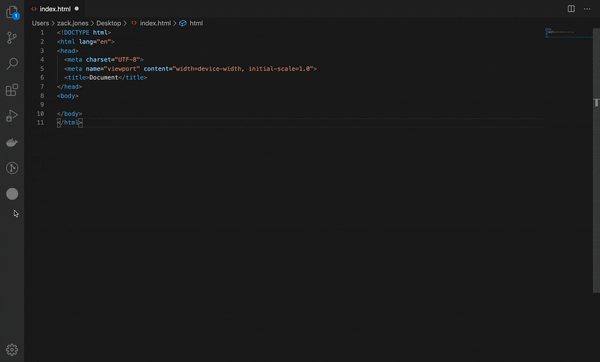

# Procrastination Tool VSCode



### Setting up API keys

1) Regiser for a free account at [Dark Sky API](https://darksky.net/dev/)

2) Regiser for a free account at [News API](https://newsapi.org/register/)

2) Add .env file by duplicating .env.example

3) Add your Dark Sky API key to DARK_SKY_API_KEY
```
DARK_SKY_API_KEY=xxxxxxxxxxxxxxx
```

3) Add your News API key to NEWS_API_KEY
```
NEWS_API_KEY=xxxxxxxxxxxxxxx
```

## Debugging Installation

1) Install npm dependencies
```
npm install
```

2) Open project in VS Code
```
code .
```

3) Start the Debugger
```
press F5 or goto Run > Start Debugging
```